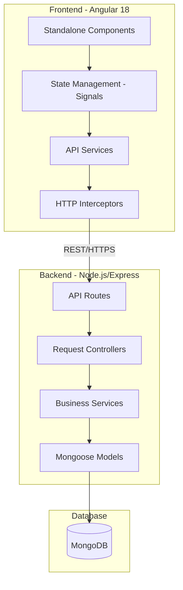

# Estoquei - Full Stack Messaging Platform

Scalable full-stack messaging platform built with the MEAN stack (MongoDB, Express.js, Angular and Node.js), designed using layered architecture principles for maintainability, modularity and long-term scalability.

The platform provides secure authentication, real-time messaging workflows and media sharing capabilities through a decoupled frontend/backend architecture.

---

# Overview

Estoquei implements a client-server architecture where the frontend and backend operate independently through RESTful communication.

The backend handles:

- Business rules
- Authentication
- Data persistence
- Media processing
- Access control

The frontend manages:

- User interaction
- Reactive state workflows
- API communication
- Route protection
- Responsive rendering

---

# System Architecture



---

# Frontend Architecture

The frontend follows a modular Angular 18 architecture using standalone components and reactive state management.

## Core Technologies

| Component | Technology |
|---|---|
| Framework | Angular 18 |
| State Management | Angular Signals |
| HTTP Communication | HttpClient |
| Authentication | JWT Interceptors |
| Styling | Vanilla CSS |
| SSR | Angular Universal |

## Frontend Features

- Standalone component architecture
- Reactive state management with Signals
- JWT authentication workflows
- Route guards and access control
- Server-side rendering support
- Modular service abstraction

---

# Backend Architecture

The backend is structured around Express.js with layered service separation and centralized middleware handling.

## Core Technologies

| Component | Technology |
|---|---|
| Runtime | Node.js |
| Framework | Express.js |
| Authentication | JWT |
| Password Security | Bcrypt |
| File Uploads | express-fileupload |
| ODM | Mongoose |

## Backend Features

- RESTful API architecture
- Centralized error handling
- Authentication middleware
- Secure password hashing
- Media upload support
- Modular business services

---

# Database Layer

| Component | Technology |
|---|---|
| Database | MongoDB |
| ODM | Mongoose |

The persistence layer follows a document-oriented model with relational population strategies to optimize data retrieval and reduce N+1 query issues.

---

# Core Features

- Secure user authentication
- JWT-based authorization
- Public and private messaging
- Media upload workflows
- Protected route system
- Reactive frontend state management
- Modular backend architecture
- Optimized MongoDB population queries
- SSR-ready frontend infrastructure

---

# Project Structure

```text
Estoquei/
├── backend/
│   ├── controllers/    
│   ├── middlewares/    
│   ├── models/         
│   ├── routes/         
│   ├── services/       
│   └── server.js       

├── frontend/
│   ├── src/
│   │   ├── app/
│   │   │   ├── login/
│   │   │   ├── signup/
│   │   │   ├── message/
│   │   │   ├── private-message/
│   │   │   ├── guards/
│   │   │   ├── services/
│   │   │   └── app.routes.ts
│   │   └── environments/

└── README.md
```

---

# Requirements

- Node.js v18+
- npm v9+
- MongoDB Local Instance or MongoDB Atlas

---

# Installation

## Clone repository

```bash
git clone https://github.com/estoquei/Estoquei.git
cd Estoquei
```

---

# Backend Setup

```bash
cd backend
npm install
```

Create a `.env` file inside the backend directory:

```env
PORT=3000
MONGODB_URI=your_mongodb_connection_string
JWT_SECRET=your_jwt_secret
```

---

# Frontend Setup

```bash
cd ../frontend
npm install
```

---

# Development Environment

## Start backend

```bash
cd backend
npm run dev
```

## Start frontend

```bash
cd frontend
npm start
```

Application URL:

```text
http://localhost:4200
```

---

# Engineering Principles

- Layered Architecture
- Separation of Concerns (SoC)
- Modular Frontend Design
- Reactive State Management
- RESTful API Standards
- Secure Authentication Flows
- Maintainable Backend Services
- SSR-Oriented Frontend Structure

---

# Security Considerations

The platform includes:

- JWT authentication
- Password hashing with Bcrypt
- Protected routes
- Centralized middleware validation
- Controlled media upload workflows

---

# Scalability Considerations

The architecture was designed to support:

- Independent frontend/backend scaling
- Modular feature expansion
- Service isolation
- Horizontal API growth
- SSR optimization strategies

---

# Future Improvements

Potential enhancements include:

- WebSocket real-time communication
- Redis session caching
- Dockerized infrastructure
- Kubernetes deployment workflows
- Message queue integration
- Notification services
- Multi-tenant architecture

---

# License

This project was developed for educational purposes and professional portfolio demonstration.
