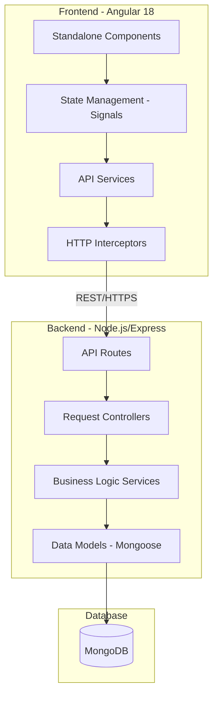

# Estoquei - Messaging System

Estoquei is a full-stack messaging platform developed using the MEAN stack (MongoDB, Express, Angular, Node.js). The system implements a layered architecture to ensure modularity, scalability, and maintainable code.

## System Architecture

The application follows a traditional client-server model with a decoupled frontend and backend. The backend manages data persistence and business logic, while the frontend handles user interaction and state management.



## Technical Specifications

### Frontend
- **Framework:** Angular 18 (Standalone Components architecture).
- **State Management:** Angular Signals for reactive data flow.
- **Communication:** HttpClient with centralized interceptors for JWT authentication.
- **Styling:** Vanilla CSS for component-scoped and global styles.
- **SSR:** Angular Universal/SSR support.

### Backend
- **Runtime:** Node.js.
- **Framework:** Express.js.
- **Authentication:** JSON Web Tokens (JWT) with Bcrypt for password hashing.
- **Middleware:** Centralized error handling and authentication guards.
- **File Handling:** express-fileupload for media management.

### Database
- **Provider:** MongoDB.
- **ODM:** Mongoose.
- **Design:** Document-oriented with relational references (Population).

## Features

- **User Authentication:** Secure signup and login with JWT.
- **Real-time Messaging:** General and private messaging capabilities.
- **Media Management:** Support for image uploads in messages.
- **Role-based Access:** Middleware-level protection for routes and actions.
- **Optimized Data Fetching:** Implementation of population to resolve N+1 query issues.

## Prerequisites

- Node.js v18.x or higher
- npm v9.x or higher
- MongoDB (Local instance or MongoDB Atlas)

## Installation and Configuration

### 1. Clone the Repository
```bash
git clone https://github.com/estoquei/Estoquei.git
cd Estoquei
```

### 2. Backend Configuration
Navigate to the backend directory and install dependencies:
```bash
cd backend
npm install
```

Create a `.env` file in the `backend` directory:
```env
PORT=3000
MONGODB_URI=your_mongodb_connection_string
JWT_SECRET=your_jwt_secret_key
```

### 3. Frontend Configuration
Navigate to the frontend directory and install dependencies:
```bash
cd ../frontend
npm install
```

## Running the Application

### Development Environment

**Start Backend:**
```bash
cd backend
npm run dev
```

**Start Frontend:**
```bash
cd frontend
npm start
```

The application will be available at `http://localhost:4200`.

## Project Structure

```text
Estoquei/
├── backend/
│   ├── controllers/    # Request handling logic
│   ├── middlewares/    # Auth and error middlewares
│   ├── models/         # Mongoose schemas
│   ├── routes/         # Express route definitions
│   ├── services/       # Business logic layer
│   └── server.js       # Entry point
├── frontend/
│   ├── src/
│   │   ├── app/
│   │   │   ├── login/           # Login component
│   │   │   ├── signup/          # Signup component
│   │   │   ├── message/         # General messaging component
│   │   │   ├── private-message/ # Private messaging component
│   │   │   ├── guards/          # Route protection
│   │   │   ├── services/        # Data services
│   │   │   └── app.routes.ts    # Frontend routing
│   │   └── environments/        # Environment configurations
└── README.md
```

## License

This project is intended for educational and professional demonstration purposes.
