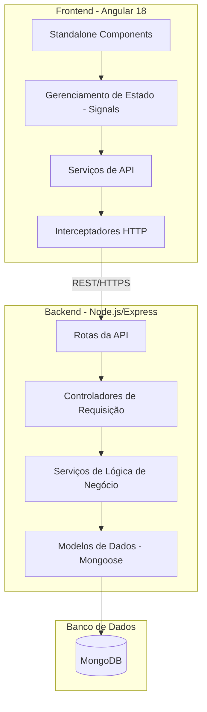

# Estoquei - Sistema de Mensageria

Estoquei é uma plataforma de mensageria full-stack desenvolvida utilizando a stack MEAN (MongoDB, Express, Angular, Node.js). O sistema implementa uma arquitetura em camadas para garantir modularidade, escalabilidade e manutenção simplificada do código.

## Arquitetura do Sistema

A aplicação segue um modelo cliente-servidor tradicional com frontend e backend desacoplados. O backend gerencia a persistência de dados e a lógica de negócio, enquanto o frontend lida com a interação do usuário e o gerenciamento de estado.



## Especificações Técnicas

### Frontend
- **Framework:** Angular 18 (arquitetura de Standalone Components).
- **Gerenciamento de Estado:** Angular Signals para fluxo de dados reativo.
- **Comunicação:** HttpClient com interceptadores centralizados para autenticação JWT.
- **Estilização:** Vanilla CSS para estilos globais e escopados por componente.
- **SSR:** Suporte a Angular Universal/SSR.

### Backend
- **Runtime:** Node.js.
- **Framework:** Express.js.
- **Autenticação:** JSON Web Tokens (JWT) com Bcrypt para hashing de senhas.
- **Middleware:** Tratamento centralizado de erros e guardas de autenticação.
- **Manipulação de Arquivos:** express-fileupload para gerenciamento de mídia.

### Banco de Dados
- **Provedor:** MongoDB.
- **ODM:** Mongoose.
- **Design:** Orientado a documentos com referências relacionais (Population).

## Funcionalidades

- **Autenticação de Usuário:** Registro e login seguros com JWT.
- **Mensageria em Tempo Real:** Capacidade de mensagens gerais e privadas.
- **Gerenciamento de Mídia:** Suporte para upload de imagens em mensagens.
- **Acesso Baseado em Regras:** Proteção de rotas e ações via middleware.
- **Busca de Dados Otimizada:** Implementação de population para resolver problemas de consulta N+1.

## Pré-requisitos

- Node.js v18.x ou superior
- npm v9.x ou superior
- MongoDB (Instância local ou MongoDB Atlas)

## Instalação e Configuração

### 1. Clonar o Repositório
```bash
git clone https://github.com/estoquei/Estoquei.git
cd Estoquei
```

### 2. Configuração do Backend
Navegue até o diretório do backend e instale as dependências:
```bash
cd backend
npm install
```

Crie um arquivo `.env` no diretório `backend`:
```env
PORT=3000
MONGODB_URI=sua_string_de_conexao_mongodb
JWT_SECRET=sua_chave_secreta_jwt
```

### 3. Configuração do Frontend
Navegue até o diretório do frontend e instale as dependências:
```bash
cd ../frontend
npm install
```

## Executando a Aplicação

### Ambiente de Desenvolvimento

**Iniciar Backend:**
```bash
cd backend
npm run dev
```

**Iniciar Frontend:**
```bash
cd frontend
npm start
```

A aplicação estará disponível em `http://localhost:4200`.

## Estrutura do Projeto

```text
Estoquei/
├── backend/
│   ├── controllers/    # Lógica de manipulação de requisições
│   ├── middlewares/    # Middlewares de autenticação e erro
│   ├── models/         # Schemas do Mongoose
│   ├── routes/         # Definições de rotas Express
│   ├── services/       # Camada de lógica de negócio
│   └── server.js       # Ponto de entrada
├── frontend/
│   ├── src/
│   │   ├── app/
│   │   │   ├── login/           # Componente de Login
│   │   │   ├── signup/          # Componente de Cadastro
│   │   │   ├── message/         # Componente de mensagens gerais
│   │   │   ├── private-message/ # Componente de mensagens privadas
│   │   │   ├── guards/          # Proteção de rotas
│   │   │   ├── services/        # Serviços de dados
│   │   │   └── app.routes.ts    # Roteamento frontend
│   │   └── environments/        # Configurações de ambiente
└── README.md
```

## Licença

Este projeto é destinado a fins educacionais e demonstração profissional.
